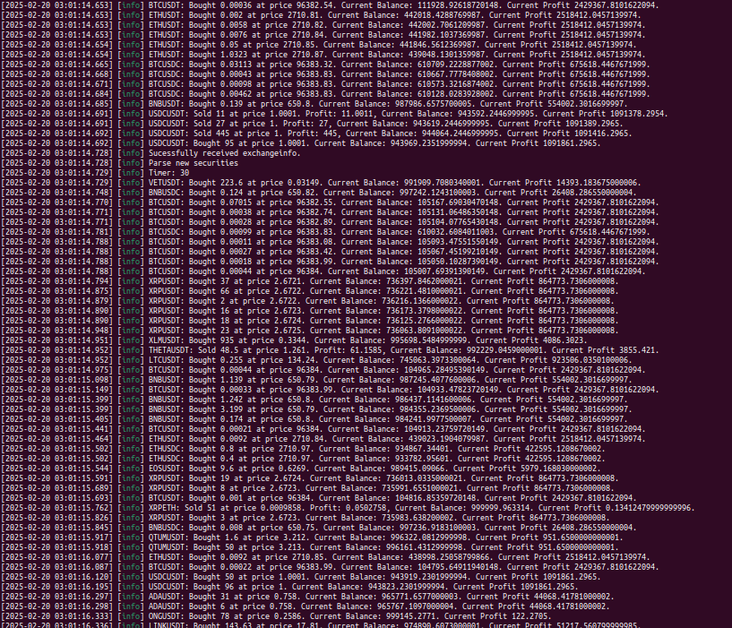

# Scrapper: Test task for position of HFT developer or something.

(Sorry for eanglish, russian keypad dont work..)

The task was to write a service that asynchronously connects to the Binance exchange at api.binance.com and fetches an HTTPS response with the securities that Binance provides. Then, it is required to filter those securities based on a config.toml file. We need to write a parser for this purpose. After that, we need to create numerous WebSocket connections to aggregate trade data. Each WebSocket runs in its own thread(or coroutine or anything else), providing responses from the service. My realization is aware of changes in config and will apply them within timeout specified in config. It handles failed connections by collecting them in a vector, and processing it later. It also stores response from exchangeinfo to a file, for additional security.

## Screenshot:


## Architecture..
I used the following libraries for development: Beast, Asio, tomlplusplus, and spdlog. I also used nlohmann::json for JSON processing. These libraries are fetched during the build process with CMake.

Here is overview of program classes
- Service (service.hpp): This is the main class. It creates two threads using std::async. The first thread is called downloadExchangeInfo, which uses boost::asio::steady_timer for repeated execution on a timeout. The second thread is the update thread, which updates the list of connections, removes unnecessary ones, and attempts to re-establish failed connections.

- BinanceSession (securitiesManager.h): async boost::beast code to https GET list of available securities.

- Parser: use its static functions to parse files

- WebSocketsManager: This class handles an unordered_map of WebSocket connections. It creates new connections, stops old ones, etc. An important point here is the _connectionsLimit variable. In Linux, there is a command ulimit -n that shows the number of available file descriptors used by WebSockets. If we are not careful and use all of them, the system may fail due to epoll or other reasons. That’s why I check this value and use it to create an upper boundary for the number of simultaneous client connections.

- WebSocketConnection: This class handles asynchronous WebSocket connections to aggregate trade streams using the Boost.Beast asynchronous model. In case of an error or exception during the runtime of this class, it pushes the symbol for this connection (e.g., "btcusdt", "ethusdt", etc.) to a list of failed connections. This list is later processed in WebSocketsManager::removeUnnecessaryConnections().

- TradingAlgorithm: each connection creates trading algorithm that uses moving average for price predictions. Data from aggregate trade stream passed to its method execute()

## Build..

In terminal:
```
cd Scrapper
mkdir build
cd build
cmake ..
make
./scrapper
```

IT IS NECESSARY to have cacert.pem from https://curl.se/docs/caextract.html this is required in order to make SSL handshake with binance.
also beware that amount of connections will depend on your ```ulimit -n``` number of descriptors.

There is example log "log.txt" thats shows what standart output should be like.
